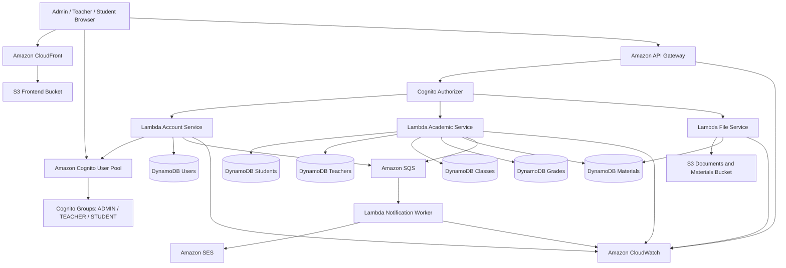

# AWS Student Management Portal

## 1. Giới thiệu dự án

**AWS Student Management Portal** là hệ thống quản lý sinh viên được xây dựng theo kiến trúc **serverless trên AWS**.  
Hệ thống phục vụ ba nhóm người dùng: **Admin, Giáo viên và Sinh viên**, với phạm vi quyền được tách biệt giữa quản trị tài khoản, quản lý học thuật và tra cứu thông tin cá nhân.

Dự án hỗ trợ quản lý tài khoản, lớp học, sinh viên, điểm số, tài liệu học tập, thông báo, lưu trữ file và nhật ký hoạt động. Toàn bộ backend được triển khai bằng các dịch vụ AWS serverless.

Dự án được thiết kế để phục vụ mục tiêu học tập, thực hành triển khai ứng dụng thực tế trên AWS và làm báo cáo/workshop triển khai.

---

## 2. Mục tiêu dự án

Dự án tập trung vào các mục tiêu chính:

- Xây dựng giao diện gồm **38 trang** cho Admin, Giáo viên, Sinh viên và các trang dùng chung.
- Phân quyền rõ ràng theo ba vai trò bằng **Amazon Cognito Groups** và kiểm tra quyền tại Lambda.
- Cho phép Admin tạo, sửa, khóa, mở khóa và xóa tài khoản người dùng.
- Cho phép Giáo viên quản lý lớp được phân công, cập nhật sinh viên, nhập điểm và đăng tài liệu.
- Cho phép Sinh viên xem hồ sơ, điểm số, tài liệu và chỉnh sửa thông tin liên hệ cá nhân.
- Triển khai frontend lên **Amazon S3** và phân phối qua **Amazon CloudFront**.
- Xây dựng backend serverless bằng **AWS Lambda** và **Amazon API Gateway**.
- Lưu dữ liệu nghiệp vụ trong **Amazon DynamoDB**.
- Lưu file trên **Amazon S3** bằng **Presigned URL**.
- Gửi thông báo email bất đồng bộ bằng **Amazon SQS** và **Amazon SES**.
- Theo dõi log, lỗi, hiệu năng và nhật ký hoạt động bằng **Amazon CloudWatch**.
- Chuẩn bị tài liệu báo cáo, ảnh chụp triển khai và Postman collection.

---

## 3. Công nghệ sử dụng

### 3.1. Frontend

| Thành phần | Công nghệ |
|---|---|
| Framework | ReactJS |
| Build tool | Vite |
| Ngôn ngữ | JavaScript |
| Gọi API | Axios / Fetch API |
| Xác thực | Amazon Cognito |
| Deploy | Amazon S3 + CloudFront |

### 3.2. Backend

| Thành phần | Công nghệ |
|---|---|
| Runtime | Node.js |
| Ngôn ngữ | JavaScript |
| Compute | AWS Lambda |
| API | Amazon API Gateway |
| Database | Amazon DynamoDB |
| File storage | Amazon S3 |
| Message queue | Amazon SQS |
| Email service | Amazon SES |
| Monitoring | Amazon CloudWatch |

### 3.3. Công cụ hỗ trợ

| Công cụ | Mục đích |
|---|---|
| VS Code | Viết code |
| GitHub | Lưu source code |
| Postman | Kiểm thử API |
| AWS Console | Tạo và quản lý dịch vụ AWS |
| Draw.io | Vẽ sơ đồ kiến trúc |
| Markdown | Viết tài liệu README và báo cáo |

---

## 4. Kiến trúc tổng quan

### 4.1. Kiến trúc hệ thống



### 4.2. Luồng hoạt động chính

#### Luồng truy cập website

```text
User Browser
→ CloudFront
→ S3 Frontend Bucket
→ React Router hiển thị trang theo đường dẫn và vai trò
```

#### Luồng đăng nhập và phân quyền

```text
Người dùng nhập email và mật khẩu
→ Frontend gửi thông tin đăng nhập đến Amazon Cognito
→ Cognito xác thực và trả JWT Token
→ Frontend đọc nhóm ADMIN / TEACHER / STUDENT từ token
→ ProtectedRoute kiểm tra quyền truy cập trang
→ API Gateway kiểm tra token bằng Cognito Authorizer
→ Lambda kiểm tra lại role và phạm vi dữ liệu trước khi xử lý
```

> Frontend chỉ dùng quyền để điều khiển giao diện. Quyền thực tế luôn phải được kiểm tra lại tại API Gateway và Lambda.

#### Luồng Admin tạo tài khoản

```text
Admin nhập thông tin tài khoản
→ POST /admin/accounts
→ Lambda Account Service kiểm tra quyền ADMIN
→ Tạo user trong Cognito bằng AdminCreateUser
→ Gán user vào nhóm ADMIN, TEACHER hoặc STUDENT
→ Lưu hồ sơ liên kết vào DynamoDB
→ Gửi thông tin đăng nhập hoặc mật khẩu tạm thời
→ Người dùng đăng nhập lần đầu và đổi mật khẩu
```

#### Luồng Giáo viên quản lý học thuật

```text
Giáo viên chọn lớp được phân công
→ Frontend gọi API kèm JWT
→ Lambda kiểm tra role TEACHER và teacherId
→ Kiểm tra lớp có thuộc giáo viên phụ trách hay không
→ Cho phép xem/sửa sinh viên, nhập điểm hoặc đăng tài liệu
→ Lưu dữ liệu vào DynamoDB và file vào S3
```

#### Luồng Sinh viên tra cứu dữ liệu

```text
Sinh viên đăng nhập
→ Lambda lấy studentId từ tài khoản Cognito liên kết
→ Chỉ trả về hồ sơ, điểm, tài liệu và thông báo thuộc sinh viên đó
→ Sinh viên chỉ được sửa các trường liên hệ được cho phép
```

#### Luồng upload tài liệu

```text
Giáo viên yêu cầu upload file
→ API Gateway
→ Lambda tạo Presigned URL
→ Frontend upload file trực tiếp lên S3
→ Frontend gọi API lưu metadata tài liệu
→ DynamoDB lưu thông tin tài liệu và lớp được phép truy cập
```

#### Luồng gửi email thông báo

```text
Lambda nghiệp vụ tạo sự kiện
→ Gửi message vào SQS
→ Lambda Notification Worker nhận message
→ Gửi email bằng Amazon SES
→ Ghi log vào CloudWatch
```

> Lambda `sendEmailWorker` được kích hoạt tự động bởi **SQS event source mapping**. Nếu SES còn ở chế độ sandbox, địa chỉ gửi và nhận phải được xác minh trước.

---
## 5. Cấu trúc thư mục dự án

```text
aws-student-management-portal/
│
├── frontend/
│   ├── public/
│   ├── src/
│   │   ├── assets/
│   │   ├── components/
│   │   │   ├── ConfirmModal.jsx
│   │   │   ├── GradeForm.jsx
│   │   │   ├── Layout.jsx
│   │   │   ├── Navbar.jsx
│   │   │   ├── ProtectedRoute.jsx
│   │   │   ├── Sidebar.jsx
│   │   │   ├── StatusBadge.jsx
│   │   │   ├── StudentForm.jsx
│   │   │   └── TeacherForm.jsx
│   │   │
│   │   ├── pages/
│   │   │   ├── Dashboard.jsx
│   │   │   ├── Login.jsx
│   │   │   │
│   │   │   ├── admin/
│   │   │   │   ├── AdminLogs.jsx
│   │   │   │   ├── AdminRoles.jsx
│   │   │   │   ├── AdminSettings.jsx
│   │   │   │   ├── AdminStudentList.jsx
│   │   │   │   ├── AdminTeacherList.jsx
│   │   │   │   ├── AdminUserCreate.jsx
│   │   │   │   ├── AdminUserDetail.jsx
│   │   │   │   ├── AdminUserEdit.jsx
│   │   │   │   └── AdminUsers.jsx
│   │   │   │
│   │   │   ├── auth/
│   │   │   │   ├── ForgotPassword.jsx
│   │   │   │   ├── NewPassword.jsx
│   │   │   │   ├── ResetPassword.jsx
│   │   │   │   └── VerifyCode.jsx
│   │   │   │
│   │   │   ├── common/
│   │   │   │   ├── ChangePassword.jsx
│   │   │   │   ├── Notifications.jsx
│   │   │   │   ├── Profile.jsx
│   │   │   │   └── ProfileEdit.jsx
│   │   │   │
│   │   │   ├── errors/
│   │   │   │   ├── Forbidden.jsx
│   │   │   │   └── NotFound.jsx
│   │   │   │
│   │   │   ├── grades/
│   │   │   │   ├── GradeCreate.jsx
│   │   │   │   ├── GradeDetail.jsx
│   │   │   │   ├── GradeEdit.jsx
│   │   │   │   ├── GradeList.jsx
│   │   │   │   └── TeacherGrades.jsx
│   │   │   │
│   │   │   ├── materials/
│   │   │   │   ├── MaterialDetail.jsx
│   │   │   │   ├── MaterialEdit.jsx
│   │   │   │   ├── StudentMaterials.jsx
│   │   │   │   └── UploadMaterial.jsx
│   │   │   │
│   │   │   ├── students/
│   │   │   │   ├── StudentCreate.jsx
│   │   │   │   ├── StudentDetail.jsx
│   │   │   │   ├── StudentDocuments.jsx
│   │   │   │   ├── StudentEdit.jsx
│   │   │   │   ├── StudentList.jsx
│   │   │   │   └── UploadDocument.jsx
│   │   │   │
│   │   │   └── teachers/
│   │   │       ├── ClassDetail.jsx
│   │   │       ├── ClassList.jsx
│   │   │       ├── TeacherCreate.jsx
│   │   │       ├── TeacherDetail.jsx
│   │   │       ├── TeacherEdit.jsx
│   │   │       └── TeacherList.jsx
│   │   │
│   │   ├── services/
│   │   │   ├── api.js
│   │   │   ├── authService.js
│   │   │   ├── adminService.js
│   │   │   ├── classService.js
│   │   │   ├── studentService.js
│   │   │   ├── teacherService.js
│   │   │   ├── gradeService.js
│   │   │   ├── materialService.js
│   │   │   └── documentService.js
│   │   │
│   │   ├── config/
│   │   │   └── awsConfig.js
│   │   ├── hooks/
│   │   ├── App.jsx
│   │   ├── main.jsx
│   │   └── index.css
│   │
│   ├── package.json
│   └── vite.config.js
│
├── backend/
│   ├── common/
│   │   ├── response.js
│   │   ├── authMiddleware.js
│   │   ├── dynamodb.js
│   │   ├── s3.js
│   │   ├── sqs.js
│   │   └── validators.js
│   ├── admin/
│   │   ├── listUsers/
│   │   ├── createUser/
│   │   ├── toggleUser/
│   │   ├── deleteUser/
│   │   ├── updateUser/
│   │   └── getCloudWatchLogs/
│   ├── students/
│   ├── teachers/
│   ├── classes/
│   ├── grades/
│   ├── materials/
│   ├── documents/
│   ├── notifications/
│   └── package.json
│
├── postman/
│   └── student-management-api.postman_collection.json
├── docs/
│   ├── architecture.md
│   ├── role-permission-matrix.md
│   ├── page-list.md
│   ├── deployment-steps.md
│   ├── api-documentation.md
│   ├── dynamodb-design.md
│   └── cleanup.md
├── screenshots/
│   ├── frontend/
│   ├── s3/
│   ├── cloudfront/
│   ├── cognito/
│   ├── api-gateway/
│   ├── lambda/
│   ├── dynamodb/
│   ├── sqs/
│   ├── ses/
│   └── cloudwatch/
└── README.md
```

---
## 6. Chức năng chính

### 6.1. Phân quyền người dùng

#### Admin — Người quản trị hệ thống

Admin quản lý tài khoản và vận hành hệ thống:

- Tạo tài khoản Admin, Giáo viên và Sinh viên.
- Sửa thông tin tài khoản, role và trạng thái.
- Khóa, mở khóa hoặc xóa tài khoản.
- Xem danh sách sinh viên và giáo viên ở chế độ chỉ đọc.
- Xem dashboard tổng quan và nhật ký hoạt động.
- Không được nhập/sửa điểm hoặc đăng tài liệu môn học.

#### Giáo viên — Người quản lý chuyên môn

Giáo viên quản lý dữ liệu học thuật trong phạm vi được phân công:

- Xem lớp và sinh viên thuộc lớp mình phụ trách.
- Cập nhật các thông tin sinh viên được hệ thống cho phép.
- Nhập, chỉnh sửa và xóa điểm có kiểm soát.
- Đăng, sửa và xóa tài liệu do chính mình tạo.
- Không được tạo tài khoản Cognito, thay đổi role hoặc quản lý sinh viên ngoài lớp.

#### Sinh viên — Người dùng cuối

Sinh viên chỉ truy cập dữ liệu của chính mình:

- Xem hồ sơ cá nhân và kết quả học tập.
- Chỉnh sửa số điện thoại, địa chỉ và ảnh đại diện.
- Xem và tải tài liệu được chia sẻ cho lớp.
- Xem thông báo và đổi mật khẩu.
- Không được sửa mã số sinh viên, lớp, chuyên ngành, role hoặc điểm.

### 6.2. Ma trận quyền

| Chức năng | Admin | Giáo viên | Sinh viên |
|---|:---:|:---:|:---:|
| Quản lý tài khoản | Có | Không | Không |
| Quản lý role và trạng thái tài khoản | Có | Không | Không |
| Xem toàn bộ sinh viên/giáo viên | Chỉ đọc | Không | Không |
| Xem sinh viên thuộc lớp | Chỉ đọc | Có | Không |
| Sửa thông tin học thuật sinh viên | Không | Trong lớp phụ trách | Không |
| Nhập và cập nhật điểm | Không | Có | Không |
| Xem điểm | Chỉ đọc khi cần kiểm tra | Theo lớp phụ trách | Điểm của mình |
| Đăng tài liệu môn học | Không | Có | Không |
| Sửa/xóa tài liệu | Không | Tài liệu của mình | Không |
| Xem/tải tài liệu | Chỉ đọc | Có | Có |
| Xem nhật ký hệ thống | Có | Không | Không |

### 6.3. Nguồn tạo tài khoản

Tài khoản không do Giáo viên hoặc Sinh viên tự tạo. **Admin tạo tài khoản từ trang quản lý tài khoản**.

```text
Admin nhập thông tin người dùng
→ Lambda tạo user trong Amazon Cognito
→ Gán user vào nhóm ADMIN / TEACHER / STUDENT
→ Lưu hồ sơ liên kết vào DynamoDB
→ Cognito hoặc SES gửi mật khẩu tạm thời
→ Người dùng đăng nhập lần đầu và đặt mật khẩu mới
```

- Cognito lưu thông tin xác thực, mật khẩu, trạng thái và nhóm quyền.
- DynamoDB lưu hồ sơ nghiệp vụ của Admin, Giáo viên hoặc Sinh viên.
- Trường `cognitoSub` dùng để liên kết tài khoản Cognito với hồ sơ DynamoDB.

### 6.4. Quản lý lớp, điểm và tài liệu

- Lớp học được gán cho Giáo viên phụ trách.
- Giáo viên chỉ truy cập lớp được phân công.
- Điểm được lưu theo sinh viên, môn học, học kỳ và người nhập.
- Tài liệu được lưu trên S3; metadata được lưu trong DynamoDB.
- Sinh viên chỉ xem tài liệu được chia sẻ cho lớp của mình.

### 6.5. Thông báo và giám sát

- SQS nhận sự kiện tạo tài khoản, cập nhật điểm hoặc đăng tài liệu.
- Lambda Worker xử lý message và gửi email bằng SES.
- CloudWatch ghi log Lambda, API Gateway và SQS.
- Activity Logs lưu các thao tác quan trọng như tạo tài khoản, đổi role, nhập điểm và xóa tài liệu.

### 6.6. Danh sách trang frontend

#### Trang dùng chung — 13 trang

| STT | Trang | Route thực tế |
|---:|---|---|
| 1 | Đăng nhập | `/login` |
| 2 | Quên mật khẩu | `/forgot-password` |
| 3 | Xác nhận mã OTP | `/verify-code` |
| 4 | Đặt lại mật khẩu | `/reset-password` |
| 5 | Đổi mật khẩu lần đầu (bắt buộc) | `/new-password` |
| 6 | Dashboard tổng quan (theo vai trò) | `/dashboard` |
| 7 | Hồ sơ cá nhân hiện tại | `/profile` |
| 8 | Chỉnh sửa hồ sơ liên lạc | `/profile/edit` |
| 9 | Đổi mật khẩu chủ động | `/change-password` |
| 10 | Thông báo hệ thống | `/notifications` |
| 11 | Không có quyền truy cập | `/403` |
| 12 | Không tìm thấy đường dẫn | `/404` |
| 13 | Fallback không tìm thấy | `*` |

#### Trang Admin — 9 trang

| STT | Trang | Route thực tế |
|---:|---|---|
| 1 | Danh sách tài khoản Cognito | `/admin/users` |
| 2 | Thêm tài khoản Cognito mới | `/admin/users/create` |
| 3 | Chi tiết tài khoản Cognito | `/admin/users/:username` |
| 4 | Chỉnh sửa quyền và trạng thái | `/admin/users/:username/edit` |
| 5 | Danh sách sinh viên (chỉ đọc) | `/admin/students` |
| 6 | Danh sách giáo viên (chỉ đọc) | `/admin/teachers` |
| 7 | Quản trị các nhóm quyền | `/admin/roles` |
| 8 | Nhật ký logs CloudWatch thời gian thực | `/admin/logs` |
| 9 | Cấu hình tham số hệ thống AWS | `/admin/settings` |

#### Trang Giáo viên — 12 trang

| STT | Trang | Route thực tế |
|---:|---|---|
| 1 | Danh sách lớp được phân công | `/classes` |
| 2 | Chi tiết lớp (Danh sách học viên lớp) | `/classes/:classId` |
| 3 | Danh sách hồ sơ giáo viên toàn trường | `/teachers` |
| 4 | Tạo hồ sơ giáo viên mới | `/teachers/new` |
| 5 | Chi tiết hồ sơ giáo viên | `/teachers/:id` |
| 6 | Chỉnh sửa hồ sơ giáo viên | `/teachers/:id/edit` |
| 7 | Bảng điểm học viên lớp học | `/grades` |
| 8 | Nhập điểm mới cho sinh viên | `/grades/new` |
| 9 | Xem chi tiết điểm số | `/grades/:id` |
| 10 | Chỉnh sửa điểm số sinh viên | `/grades/:id/edit` |
| 11 | Bảng điểm do chính giáo viên quản lý | `/teacher-grades` |
| 12 | Chỉnh sửa tài liệu học tập lớp | `/materials/:id/edit` |

#### Trang Sinh viên — 8 trang

| STT | Trang | Route thực tế |
|---:|---|---|
| 1 | Danh sách hồ sơ sinh viên toàn trường | `/students` |
| 2 | Tạo hồ sơ sinh viên mới | `/students/new` |
| 3 | Chi tiết hồ sơ sinh viên | `/students/:id` |
| 4 | Chỉnh sửa thông tin hồ sơ sinh viên | `/students/:id/edit` |
| 5 | Danh sách hồ sơ S3 cá nhân sinh viên | `/students/:id/documents` |
| 6 | Tải lên tài liệu cá nhân sinh viên | `/documents/upload` |
| 7 | Tải lên tài liệu môn học lớp (Giáo viên) | `/materials/upload` |
| 8 | Xem tài liệu môn học lớp (Sinh viên) | `/materials` |

**Tổng cộng: 42 trang.**

### 6.7. Thống kê button giao diện

| Nhóm trang | Số trang | Tổng button theo loại hành động |
|---|---:|---:|
| Trang dùng chung | 10 | 23 |
| Trang Admin | 9 | 37 |
| Trang Giáo viên | 12 | 47 |
| Trang Sinh viên | 7 | 22 |
| **Tổng cộng** | **38** | **129** |

Con số 129 được tính theo loại button xuất hiện trên từng trang, không nhân theo số dòng dữ liệu trong bảng. Dự án nên dùng một component `Button` chung với các biến thể:

- `primary`: đăng nhập, lưu, tạo mới, tải lên.
- `secondary`: quay lại, hủy, làm mới.
- `success`: xác nhận, kích hoạt, mở khóa.
- `warning`: chỉnh sửa, khóa tài khoản.
- `danger`: xóa tài khoản, xóa điểm, xóa tài liệu.
- `icon`: xem, sửa, tải xuống và xóa trong bảng.

---
## 7. Thiết kế DynamoDB

Dự án đề xuất sử dụng các bảng sau:

| Bảng | Khóa chính | Mục đích |
|---|---|---|
| `Users` | `userId` | Liên kết tài khoản Cognito với role và hồ sơ nghiệp vụ |
| `Students` | `studentId` | Lưu hồ sơ sinh viên |
| `Teachers` | `teacherId` | Lưu hồ sơ giáo viên |
| `Classes` | `classId` | Lưu lớp học và giáo viên phụ trách |
| `Grades` | `studentId` + `gradeId` | Lưu điểm theo sinh viên, môn và học kỳ |
| `Materials` | `classId` + `materialId` | Lưu metadata tài liệu theo lớp |
| `Notifications` | `userId` + `notificationId` | Lưu thông báo của từng người dùng |
| `ActivityLogs` | `logId` | Lưu nhật ký thao tác quan trọng |
| `StudentDocuments` | `studentId` + `documentId` | Lưu metadata hồ sơ/file riêng của sinh viên nếu triển khai |

### 7.1. Bảng Users

| Thuộc tính | Kiểu | Mô tả |
|---|---|---|
| `userId` | String | Partition Key, thường dùng Cognito `sub` |
| `email` | String | Email đăng nhập |
| `role` | String | `ADMIN`, `TEACHER` hoặc `STUDENT` |
| `profileId` | String | `teacherId`, `studentId` hoặc mã hồ sơ Admin |
| `status` | String | `ACTIVE`, `LOCKED`, `INACTIVE` |
| `createdAt` | String | Thời gian tạo |
| `updatedAt` | String | Thời gian cập nhật |

### 7.2. Bảng Students

| Thuộc tính | Kiểu | Mô tả |
|---|---|---|
| `studentId` | String | Partition Key, mã số sinh viên |
| `cognitoSub` | String | Liên kết với tài khoản Cognito |
| `fullName` | String | Họ tên chính thức |
| `email` | String | Email |
| `phone` | String | Số điện thoại được phép cập nhật |
| `address` | String | Địa chỉ liên hệ |
| `dateOfBirth` | String | Ngày sinh |
| `gender` | String | Giới tính |
| `major` | String | Chuyên ngành |
| `classId` | String | Lớp hiện tại |
| `course` | String | Khóa học |
| `status` | String | Trạng thái học tập |
| `createdAt` | String | Thời gian tạo |
| `updatedAt` | String | Thời gian cập nhật |

### 7.3. Bảng Teachers và Classes

- `Teachers` lưu `teacherId`, `cognitoSub`, họ tên, email, bộ môn và trạng thái.
- `Classes` lưu `classId`, tên lớp, ngành, khóa học và `teacherId` phụ trách.
- Có thể tạo GSI theo `teacherId` để lấy nhanh danh sách lớp của Giáo viên.

### 7.4. Bảng Grades

| Thuộc tính | Kiểu | Mô tả |
|---|---|---|
| `studentId` | String | Partition Key |
| `gradeId` | String | Sort Key |
| `classId` | String | Lớp của sinh viên |
| `subjectId` | String | Mã môn học |
| `semester` | String | Học kỳ |
| `attendanceScore` | Number | Điểm chuyên cần |
| `midtermScore` | Number | Điểm giữa kỳ |
| `finalScore` | Number | Điểm cuối kỳ |
| `totalScore` | Number | Điểm tổng kết |
| `teacherId` | String | Giáo viên nhập điểm |
| `updatedAt` | String | Thời gian cập nhật |

### 7.5. Bảng Materials

| Thuộc tính | Kiểu | Mô tả |
|---|---|---|
| `classId` | String | Partition Key |
| `materialId` | String | Sort Key |
| `title` | String | Tên tài liệu |
| `description` | String | Mô tả |
| `subjectId` | String | Môn học |
| `s3Key` | String | Đường dẫn object trên S3 |
| `fileName` | String | Tên file |
| `uploadedBy` | String | `teacherId` của người đăng |
| `uploadedAt` | String | Thời gian đăng |

### 7.6. Chỉ mục đề xuất

- `Users`: GSI theo `email` và `role`.
- `Students`: GSI theo `classId`.
- `Classes`: GSI theo `teacherId`.
- `Grades`: GSI theo `classId`, `teacherId` hoặc `subjectId` tùy truy vấn.
- `Materials`: GSI theo `uploadedBy` để kiểm tra quyền sửa/xóa tài liệu.

---
## 8. Thiết kế API

Tất cả API nghiệp vụ đều yêu cầu JWT hợp lệ. Ngoài Cognito Authorizer, Lambda phải kiểm tra role và phạm vi dữ liệu.

### 8.1. API Admin quản lý tài khoản

| Method | Endpoint | Chức năng |
|---|---|---|
| GET | `/admin/accounts` | Lấy danh sách tài khoản |
| POST | `/admin/accounts` | Tạo tài khoản Cognito và hồ sơ DynamoDB |
| GET | `/admin/accounts/{userId}` | Xem chi tiết tài khoản |
| PUT | `/admin/accounts/{userId}` | Cập nhật thông tin tài khoản |
| PATCH | `/admin/accounts/{userId}/status` | Khóa hoặc mở khóa tài khoản |
| PATCH | `/admin/accounts/{userId}/role` | Cập nhật vai trò |
| DELETE | `/admin/accounts/{userId}` | Xóa hoặc vô hiệu hóa tài khoản |
| GET | `/admin/students` | Xem danh sách sinh viên chỉ đọc |
| GET | `/admin/teachers` | Xem danh sách giáo viên chỉ đọc |
| GET | `/admin/activity-logs` | Xem nhật ký hoạt động |

### 8.2. API Giáo viên quản lý lớp và sinh viên

| Method | Endpoint | Chức năng |
|---|---|---|
| GET | `/teacher/classes` | Lấy lớp được phân công |
| GET | `/teacher/classes/{classId}` | Xem chi tiết lớp |
| GET | `/teacher/classes/{classId}/students` | Xem sinh viên trong lớp |
| GET | `/teacher/students/{studentId}` | Xem chi tiết sinh viên thuộc lớp |
| PUT | `/teacher/students/{studentId}` | Cập nhật trường được phép |

### 8.3. API quản lý điểm

| Method | Endpoint | Chức năng |
|---|---|---|
| GET | `/teacher/grades` | Lấy danh sách điểm theo lớp/môn |
| POST | `/teacher/grades` | Nhập điểm |
| PUT | `/teacher/grades/{gradeId}` | Cập nhật điểm |
| DELETE | `/teacher/grades/{gradeId}` | Xóa điểm có kiểm soát |
| GET | `/me/grades` | Sinh viên xem điểm của mình |
| GET | `/me/grades/{gradeId}` | Sinh viên xem chi tiết điểm |

### 8.4. API quản lý tài liệu

| Method | Endpoint | Chức năng |
|---|---|---|
| GET | `/teacher/materials` | Lấy tài liệu của Giáo viên |
| POST | `/teacher/materials` | Lưu metadata tài liệu mới |
| PUT | `/teacher/materials/{materialId}` | Cập nhật tài liệu của chính mình |
| DELETE | `/teacher/materials/{materialId}` | Xóa tài liệu của chính mình |
| POST | `/materials/upload-url` | Tạo Presigned URL upload S3 |
| GET | `/me/materials` | Sinh viên xem tài liệu của lớp |
| GET | `/me/materials/{materialId}` | Xem chi tiết tài liệu |

### 8.5. API hồ sơ cá nhân và thông báo

| Method | Endpoint | Chức năng |
|---|---|---|
| GET | `/me/profile` | Lấy hồ sơ của người đang đăng nhập |
| PUT | `/me/profile` | Cập nhật các trường cá nhân được phép |
| GET | `/me/notifications` | Lấy danh sách thông báo |
| PATCH | `/me/notifications/{notificationId}/read` | Đánh dấu đã đọc |
| PATCH | `/me/notifications/read-all` | Đánh dấu tất cả đã đọc |
| DELETE | `/me/notifications/{notificationId}` | Xóa thông báo |

### 8.6. API thông báo email

Email được xử lý bất đồng bộ. Lambda nghiệp vụ gửi message vào SQS, sau đó `sendEmailWorker` gửi email qua SES. Không cần mở endpoint công khai để gửi email trực tiếp.

---
## 9. Chuẩn response API

### 9.1. Response thành công

```json
{
  "success": true,
  "message": "Request processed successfully",
  "data": {}
}
```

### 9.2. Response lỗi

```json
{
  "success": false,
  "message": "Error message",
  "error": "Detailed error information"
}
```

### 9.3. HTTP status code sử dụng

| Status code | Ý nghĩa |
|---|---|
| 200 | Thành công |
| 201 | Tạo mới thành công |
| 400 | Dữ liệu request không hợp lệ |
| 401 | Chưa đăng nhập hoặc token không hợp lệ |
| 403 | Không có quyền truy cập |
| 404 | Không tìm thấy dữ liệu |
| 500 | Lỗi server |

---

## 10. Biến môi trường

### 10.1. Frontend

Tạo file `frontend/.env`:

```env
VITE_AWS_REGION=ap-southeast-1
VITE_API_ENDPOINT=https://<api-id>.execute-api.ap-southeast-1.amazonaws.com/prod
VITE_COGNITO_USER_POOL_ID=ap-southeast-1_xxxxxxxxx
VITE_COGNITO_CLIENT_ID=xxxxxxxxxxxxxxxxxxxxxxxxxx
```

Không đưa Access Key, Secret Key hoặc thông tin nhạy cảm vào frontend.

### 10.2. Backend Lambda

```env
USERS_TABLE=Users
STUDENTS_TABLE=Students
TEACHERS_TABLE=Teachers
CLASSES_TABLE=Classes
GRADES_TABLE=Grades
MATERIALS_TABLE=Materials
NOTIFICATIONS_TABLE=Notifications
ACTIVITY_LOGS_TABLE=ActivityLogs
DOCUMENTS_TABLE=StudentDocuments
FILES_BUCKET=student-management-files-<account-id>
COGNITO_USER_POOL_ID=ap-southeast-1_xxxxxxxxx
NOTIFICATION_QUEUE_URL=https://sqs.ap-southeast-1.amazonaws.com/<account-id>/student-notification-queue
FROM_EMAIL=noreply@example.com
```

Region nên lấy từ biến môi trường `AWS_REGION` do Lambda cung cấp, không hard-code trong source code.

---

## 11. Hướng dẫn chạy Frontend ở local

### 11.1. Di chuyển vào thư mục frontend

```bash
cd frontend
```

### 11.2. Cài đặt thư viện

```bash
npm install
```

### 11.3. Tạo file môi trường

Tạo `.env` trong thư mục `frontend/`:

```env
VITE_AWS_REGION=ap-southeast-1
VITE_API_ENDPOINT=https://your-api-id.execute-api.ap-southeast-1.amazonaws.com/prod
VITE_COGNITO_USER_POOL_ID=your-user-pool-id
VITE_COGNITO_CLIENT_ID=your-app-client-id
```

### 11.4. Chạy dự án

```bash
npm run dev
```

Frontend sẽ chạy ở địa chỉ:

```text
http://localhost:5173
```

### 11.5. Build frontend

```bash
npm run build
```

Sau khi build, thư mục `dist/` sẽ được tạo. Thư mục này dùng để upload lên S3.

---

## 12. Hướng dẫn chuẩn bị Backend Lambda

### 12.1. Di chuyển vào thư mục backend

```bash
cd backend
```

### 12.2. Cài đặt thư viện

```bash
npm install
```

### 12.3. Đóng gói Lambda

Có thể zip từng Lambda function để upload thủ công hoặc dùng AWS SAM/CDK để triển khai đồng bộ.

Ví dụ với Account Service:

```bash
cd backend/accounts/accountService
zip -r accountService.zip .
```

Nếu Lambda dùng mã trong `common/`, cần đóng gói kèm thư mục dùng chung hoặc cấu hình Lambda Layer.

---

## 13. Quy trình triển khai AWS theo 17 bước

### Bước 1. Code frontend giao diện cơ bản

Tạo trước layout, route và dữ liệu mẫu cho 38 trang:

- 10 trang dùng chung.
- 9 trang Admin.
- 12 trang Giáo viên.
- 7 trang Sinh viên.

Ưu tiên làm theo thứ tự: đăng nhập → layout chung → Admin accounts → Teacher classes/grades/materials → Student profile/grades/materials → 403/404.

### Bước 2. Tạo các bảng DynamoDB

Tạo tối thiểu các bảng:

```text
Users
Students
Teachers
Classes
Grades
Materials
Notifications
ActivityLogs
```

Có thể tạo thêm `StudentDocuments` nếu vẫn triển khai hồ sơ riêng của sinh viên.

### Bước 3. Code Lambda nghiệp vụ

Chia Lambda theo domain:

- Account Service: tạo, sửa, khóa và xóa tài khoản Cognito.
- Student/Teacher/Class Service: truy xuất và cập nhật hồ sơ.
- Grade Service: nhập và cập nhật điểm.
- Material Service: quản lý metadata tài liệu.
- File Service: tạo Presigned URL.
- Notification Worker: đọc SQS và gửi email SES.
- Audit Service: ghi nhật ký hoạt động.

### Bước 4. Tạo API Gateway kết nối Lambda

Tạo route theo nhóm `/admin`, `/teacher`, `/me` và `/materials` như phần thiết kế API. Gắn Lambda tương ứng và cấu hình CORS.

### Bước 5. Test API bằng Postman

- Test từng role với token riêng.
- Kiểm tra Admin không thể nhập điểm hoặc đăng tài liệu.
- Kiểm tra Giáo viên không thể truy cập lớp không được phân công.
- Kiểm tra Sinh viên không thể xem dữ liệu của sinh viên khác.
- Kiểm tra response 401, 403 và 404.

### Bước 6. Tạo Cognito User Pool

- Tạo App Client cho frontend.
- Tạo các nhóm `ADMIN`, `TEACHER`, `STUDENT`.
- Tạo một tài khoản Admin đầu tiên bằng AWS Console hoặc script triển khai.
- Bật luồng đổi mật khẩu khi đăng nhập lần đầu.

### Bước 7. Gắn Cognito Authorizer vào API Gateway

Gắn Authorizer vào toàn bộ route nghiệp vụ. Chỉ để các chức năng đăng nhập, quên mật khẩu và đặt lại mật khẩu giao tiếp trực tiếp với Cognito.

### Bước 8. Kết nối frontend với Cognito và API Gateway

Frontend cần:

- Đăng nhập và lấy JWT Token.
- Xác định group từ token.
- Dùng `RoleRoute` để điều hướng theo vai trò.
- Gửi token trong header `Authorization` khi gọi API.
- Xử lý lỗi 401 và 403.

### Bước 9. Deploy frontend lên S3

```bash
npm run build
aws s3 sync dist/ s3://student-management-frontend --delete
```

### Bước 10. Cấu hình CloudFront

- Dùng S3 frontend bucket làm origin.
- Dùng Origin Access Control để tránh public bucket trực tiếp.
- Cấu hình lỗi 403/404 trả về `index.html` để React Router hoạt động.

### Bước 11. Tạo S3 bucket lưu file

Tạo bucket riêng tư, ví dụ:

```text
student-management-files-<account-id>
```

Cấu trúc object đề xuất:

```text
materials/{classId}/{materialId}/{fileName}
students/{studentId}/documents/{documentId}/{fileName}
profiles/{userId}/{fileName}
```

### Bước 12. Code Lambda tạo Presigned URL

Lambda kiểm tra role, loại file, dung lượng và prefix S3 trước khi cấp URL. Presigned URL nên có thời hạn ngắn.

### Bước 13. Lưu metadata file vào DynamoDB

Sau khi upload thành công, frontend gọi API lưu `s3Key`, `fileName`, `classId`, `uploadedBy` và thời gian upload.

### Bước 14. Tạo SQS Queue

Tạo queue:

```text
student-notification-queue
```

Có thể tạo Dead-letter Queue để lưu message xử lý thất bại.

### Bước 15. Code Lambda Worker gửi email bằng SES

Các sự kiện gửi email có thể gồm:

- Tài khoản mới được tạo.
- Tài khoản bị khóa hoặc mở khóa.
- Điểm mới được cập nhật.
- Tài liệu mới được đăng.

### Bước 16. Bật CloudWatch Logs và Alarm

Theo dõi Lambda Error, API Gateway 4XX/5XX, SQS message tồn đọng và lỗi gửi email. Ghi Activity Log cho các thao tác quan trọng.

### Bước 17. Chụp màn hình, viết báo cáo và dọn tài nguyên

Chụp giao diện theo ba role và các dịch vụ AWS: S3, CloudFront, Cognito, API Gateway, Lambda, DynamoDB, SQS, SES và CloudWatch.

---
## 14. IAM Role và quyền cần thiết

### 14.1. Lambda Account Service Role

```text
cognito-idp:AdminCreateUser
cognito-idp:AdminUpdateUserAttributes
cognito-idp:AdminEnableUser
cognito-idp:AdminDisableUser
cognito-idp:AdminDeleteUser
cognito-idp:AdminAddUserToGroup
cognito-idp:AdminRemoveUserFromGroup
dynamodb:GetItem
dynamodb:PutItem
dynamodb:UpdateItem
dynamodb:DeleteItem
dynamodb:Query
logs:CreateLogGroup
logs:CreateLogStream
logs:PutLogEvents
```

### 14.2. Lambda Academic Service Role

```text
dynamodb:GetItem
dynamodb:PutItem
dynamodb:UpdateItem
dynamodb:DeleteItem
dynamodb:Query
dynamodb:Scan
sqs:SendMessage
logs:CreateLogGroup
logs:CreateLogStream
logs:PutLogEvents
```

Quyền DynamoDB phải giới hạn vào đúng ARN của các bảng cần dùng.

### 14.3. Lambda File Service Role

```text
s3:PutObject
s3:GetObject
s3:DeleteObject
dynamodb:PutItem
dynamodb:GetItem
dynamodb:UpdateItem
dynamodb:DeleteItem
dynamodb:Query
logs:CreateLogGroup
logs:CreateLogStream
logs:PutLogEvents
```

### 14.4. Lambda Notification Worker Role

```text
sqs:ReceiveMessage
sqs:DeleteMessage
sqs:GetQueueAttributes
ses:SendEmail
ses:SendRawEmail
logs:CreateLogGroup
logs:CreateLogStream
logs:PutLogEvents
```

---
## 15. Kiểm thử bằng Postman

Tạo ba biến token trong Postman: `ADMIN_TOKEN`, `TEACHER_TOKEN` và `STUDENT_TOKEN`. Mỗi request gửi JWT trong header `Authorization`.

### 15.1. Admin tạo tài khoản Sinh viên

```http
POST /admin/accounts
Authorization: {{ADMIN_TOKEN}}
```

```json
{
  "email": "nguyenvana@example.com",
  "role": "STUDENT",
  "studentId": "SV001",
  "fullName": "Nguyen Van A",
  "classId": "IT01",
  "major": "Information Technology"
}
```

Kết quả mong đợi: Cognito tạo user, user được thêm vào nhóm `STUDENT`, hồ sơ được lưu vào DynamoDB và API trả status `201`.

### 15.2. Giáo viên xem sinh viên trong lớp

```http
GET /teacher/classes/IT01/students
Authorization: {{TEACHER_TOKEN}}
```

Kết quả mong đợi:

- Trả danh sách khi Giáo viên được phân công lớp `IT01`.
- Trả `403` nếu Giáo viên không phụ trách lớp này.

### 15.3. Giáo viên nhập điểm

```http
POST /teacher/grades
Authorization: {{TEACHER_TOKEN}}
```

```json
{
  "studentId": "SV001",
  "classId": "IT01",
  "subjectId": "AWS101",
  "semester": "2026-1",
  "attendanceScore": 9,
  "midtermScore": 8,
  "finalScore": 8.5
}
```

Lambda phải kiểm tra sinh viên thuộc lớp do Giáo viên phụ trách trước khi ghi dữ liệu.

### 15.4. Sinh viên xem điểm của mình

```http
GET /me/grades
Authorization: {{STUDENT_TOKEN}}
```

API lấy `studentId` từ tài khoản đăng nhập và không cho phép truyền mã sinh viên khác để xem dữ liệu.

### 15.5. Kiểm thử phân quyền bắt buộc

| Trường hợp | Kết quả mong đợi |
|---|---|
| Sinh viên gọi `/admin/accounts` | `403 Forbidden` |
| Admin gọi API nhập điểm | `403 Forbidden` |
| Giáo viên truy cập lớp không phụ trách | `403 Forbidden` |
| Người dùng không gửi token | `401 Unauthorized` |
| Token hết hạn hoặc không hợp lệ | `401 Unauthorized` |
| Sinh viên sửa `studentId`, `major` hoặc `classId` | `400` hoặc `403` |
| Giáo viên sửa/xóa tài liệu của người khác | `403 Forbidden` |

---

## 16. Quy ước đặt tên tài nguyên AWS

| Tài nguyên | Tên đề xuất |
|---|---|
| S3 frontend bucket | `student-management-frontend-<account-id>` |
| S3 files bucket | `student-management-files-<account-id>` |
| DynamoDB users | `Users` |
| DynamoDB students | `Students` |
| DynamoDB teachers | `Teachers` |
| DynamoDB classes | `Classes` |
| DynamoDB grades | `Grades` |
| DynamoDB materials | `Materials` |
| DynamoDB notifications | `Notifications` |
| DynamoDB activity logs | `ActivityLogs` |
| API Gateway | `student-management-api` |
| Cognito User Pool | `student-management-user-pool` |
| Cognito Groups | `ADMIN`, `TEACHER`, `STUDENT` |
| SQS Queue | `student-notification-queue` |
| SQS Dead-letter Queue | `student-notification-dlq` |
| Lambda account service | `accountService` |
| Lambda academic service | `academicService` |
| Lambda file service | `fileService` |
| Lambda email worker | `sendEmailWorker` |
| CloudFront | `student-management-cloudfront` |
| CloudWatch Alarm | `student-management-lambda-error-alarm` |

---
## 17. CORS

Khi frontend gọi API Gateway, cần bật CORS cho API.

Header đề xuất:

```http
Access-Control-Allow-Origin: *
Access-Control-Allow-Headers: Content-Type,Authorization
Access-Control-Allow-Methods: GET,POST,PUT,PATCH,DELETE,OPTIONS
```

Khi triển khai thực tế, nên thay `*` bằng domain CloudFront của website để bảo mật hơn.

---

## 18. Bảo mật

- Không hard-code Access Key, Secret Key hoặc thông tin nhạy cảm.
- Không lưu mật khẩu trong DynamoDB; mật khẩu do Cognito quản lý.
- Gắn Cognito Authorizer vào các API nghiệp vụ.
- Kiểm tra role ở Lambda, không chỉ ẩn button trên frontend.
- Giáo viên phải được kiểm tra `teacherId` và `classId` trước mọi thao tác học thuật.
- Sinh viên phải lấy `studentId` từ tài khoản đăng nhập, không tin `studentId` do frontend tự gửi.
- Admin không được gọi API nhập điểm hoặc quản lý tài liệu học thuật.
- S3 bucket phải private và chỉ cấp quyền bằng Presigned URL hoặc CloudFront OAC.
- Giới hạn loại file, dung lượng file và thời hạn Presigned URL.
- Dùng IAM theo nguyên tắc quyền tối thiểu.
- Ghi Activity Log cho thao tác tạo/xóa tài khoản, đổi role, nhập điểm và xóa tài liệu.
- Không xóa cứng dữ liệu quan trọng nếu chưa có cơ chế sao lưu; ưu tiên trạng thái `INACTIVE` hoặc soft delete.

---
## 19. Dọn dẹp tài nguyên

Sau khi hoàn thành workshop hoặc demo, cần xóa tài nguyên để tránh phát sinh chi phí.

Danh sách cần dọn:

- CloudFront Distribution
- S3 frontend bucket
- S3 files bucket
- API Gateway
- Lambda functions
- DynamoDB tables
- Cognito User Pool
- SQS Queue
- SES identity nếu không dùng nữa
- CloudWatch Log Groups
- CloudWatch Alarms
- SNS Topic nếu có

---

## 20. Nội dung báo cáo gợi ý

```text
1. Giới thiệu dự án
2. Lý do chọn đề tài
3. Mục tiêu dự án
4. Kiến trúc hệ thống
5. Dịch vụ AWS sử dụng
6. Phân tích ba vai trò Admin, Giáo viên, Sinh viên
7. Ma trận phân quyền
8. Danh sách 38 trang frontend
9. Thiết kế giao diện và component dùng chung
10. Thiết kế DynamoDB
11. Thiết kế API theo role
12. Triển khai Cognito và Cognito Groups
13. Triển khai Lambda và API Gateway
14. Upload file bằng S3 Presigned URL
15. Gửi thông báo bằng SQS và SES
16. Giám sát và nhật ký bằng CloudWatch
17. Kiểm thử phân quyền bằng Postman
18. Deploy frontend bằng S3 và CloudFront
19. Kết quả, hạn chế và hướng phát triển
20. Dọn dẹp tài nguyên và kết luận
```

---
## 21. Hướng phát triển

- Import tài khoản sinh viên hàng loạt từ CSV/Excel.
- Thêm quy trình duyệt thay đổi thông tin pháp lý của sinh viên.
- Thêm môn học, học kỳ và lịch giảng dạy.
- Xuất bảng điểm và danh sách sinh viên ra Excel/PDF.
- Thêm dashboard thống kê theo lớp, ngành và học kỳ.
- Thêm versioning hoặc lịch sử chỉnh sửa điểm.
- Tích hợp CI/CD bằng GitHub Actions, CodeBuild hoặc CodePipeline.
- Dùng AWS SAM, CDK hoặc Terraform để tự động hóa hạ tầng.
- Thêm AWS WAF, Route 53 và domain riêng.
- Bật Point-in-time Recovery cho DynamoDB và versioning cho S3.

---

## 22. Kết luận

Dự án **AWS Student Management Portal** triển khai mô hình quản lý sinh viên theo ba vai trò rõ ràng:

- **Admin** quản lý tài khoản và vận hành hệ thống.
- **Giáo viên** quản lý lớp, sinh viên, điểm và tài liệu trong phạm vi được phân công.
- **Sinh viên** xem dữ liệu của chính mình và cập nhật thông tin liên hệ cơ bản.

Với 38 trang frontend và kiến trúc serverless gồm **S3, CloudFront, Cognito, API Gateway, Lambda, DynamoDB, SQS, SES và CloudWatch**, dự án đáp ứng đầy đủ mục tiêu học tập, triển khai demo và viết báo cáo thực hành AWS.
