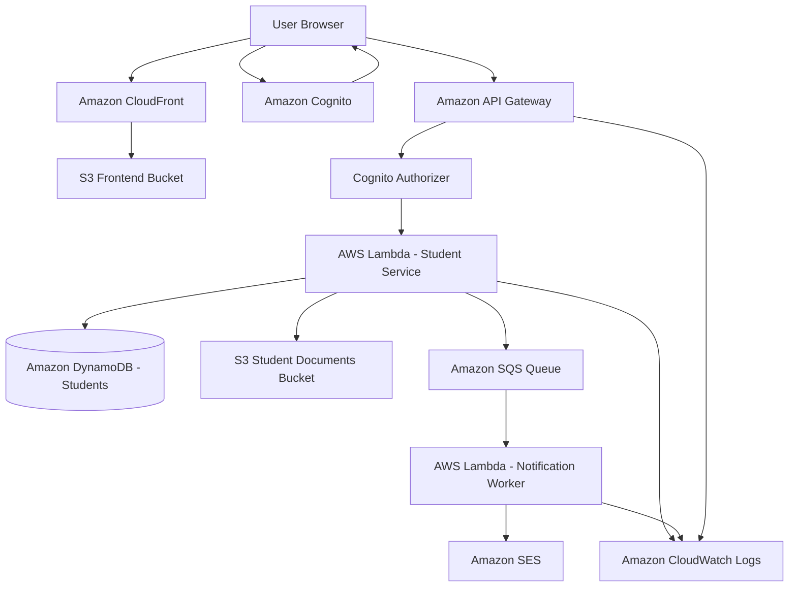

# AWS Student Management Portal

## 1. Giới thiệu dự án

**AWS Student Management Portal** là hệ thống quản lý sinh viên được xây dựng theo kiến trúc **serverless trên AWS**.  
Dự án cho phép người dùng quản lý thông tin sinh viên, upload hồ sơ sinh viên, xác thực người dùng, gửi thông báo email và giám sát hệ thống thông qua các dịch vụ AWS.

Dự án được thiết kế để phục vụ mục tiêu học tập, thực hành triển khai ứng dụng thực tế trên AWS và làm báo cáo/workshop triển khai.

---

## 2. Mục tiêu dự án

Dự án tập trung vào các mục tiêu chính:

- Xây dựng giao diện web quản lý sinh viên.
- Triển khai frontend lên **Amazon S3** và phân phối qua **Amazon CloudFront**.
- Xây dựng backend serverless bằng **AWS Lambda**.
- Tạo REST API thông qua **Amazon API Gateway**.
- Lưu thông tin sinh viên trong **Amazon DynamoDB**.
- Xác thực và phân quyền người dùng bằng **Amazon Cognito**.
- Upload hồ sơ sinh viên lên **Amazon S3** bằng **Presigned URL**.
- Gửi thông báo email bằng **Amazon SQS** và **Amazon SES**.
- Theo dõi log, lỗi và hiệu năng bằng **Amazon CloudWatch**.
- Chuẩn bị tài liệu báo cáo, ảnh chụp triển khai và Postman collection.

---

## 3. Công nghệ sử dụng

### 3.1. Frontend

| Thành phần | Công nghệ |
|---|---|
| Framework | ReactJS |
| Build tool | Vite |
| Ngôn ngữ | JavaScript |
| Gọi API | Axios / Fetch API |
| Xác thực | Amazon Cognito |
| Deploy | Amazon S3 + CloudFront |

### 3.2. Backend

| Thành phần | Công nghệ |
|---|---|
| Runtime | Node.js |
| Ngôn ngữ | JavaScript |
| Compute | AWS Lambda |
| API | Amazon API Gateway |
| Database | Amazon DynamoDB |
| File storage | Amazon S3 |
| Message queue | Amazon SQS |
| Email service | Amazon SES |
| Monitoring | Amazon CloudWatch |

### 3.3. Công cụ hỗ trợ

| Công cụ | Mục đích |
|---|---|
| VS Code | Viết code |
| GitHub | Lưu source code |
| Postman | Kiểm thử API |
| AWS Console | Tạo và quản lý dịch vụ AWS |
| Draw.io | Vẽ sơ đồ kiến trúc |
| Markdown | Viết tài liệu README và báo cáo |

---

## 4. Kiến trúc tổng quan

### 4.1. Kiến trúc hệ thống



### 4.2. Luồng hoạt động chính

#### Luồng truy cập website

```text
User Browser
→ CloudFront
→ S3 Frontend Bucket
→ Website được hiển thị cho người dùng
```

#### Luồng đăng nhập

```text
User nhập tài khoản (email + password)
→ Frontend gửi đến Cognito via AWS Amplify (signIn)
→ Cognito xác thực
→ Amplify trả về session; frontend lấy idToken qua fetchAuthSession()
→ Frontend lưu idToken (localStorage) để gọi API
```

> Lưu ý thực tế: Amplify v6 dùng `fetchAuthSession()` (không phải `getCurrentUser()`) để lấy JWT.

#### Luồng quản lý sinh viên

```text
Frontend
→ API Gateway
→ Cognito Authorizer kiểm tra token
→ Lambda xử lý nghiệp vụ
→ DynamoDB lưu hoặc truy xuất dữ liệu
→ Lambda trả kết quả
→ API Gateway trả response về frontend
```

#### Luồng upload hồ sơ sinh viên

```text
Frontend yêu cầu upload file
→ API Gateway
→ Lambda tạo Presigned URL
→ Frontend nhận Presigned URL
→ Frontend upload file trực tiếp lên S3
→ Lambda lưu metadata hồ sơ vào DynamoDB
```

#### Luồng gửi email thông báo (bất đồng bộ)

```text
Lambda xử lý nghiệp vụ (Student/Document)
→ Gửi message vào SQS (sendEmailWorker được trigger qua SQS event source mapping)
→ Lambda Notification Worker đọc message từ SQS
→ Gửi email bằng SES
→ Ghi log vào CloudWatch
```

> Thực tế: Lambda `sendEmailWorker` được kích hoạt tự động bởi **SQS event source mapping** (không gọi thủ công).
> Do tài khoản SES ở chế độ sandbox, sender `noreply@example.com` và mọi địa chỉ nhận đều phải verify trước.

---

## 5. Cấu trúc thư mục dự án

```text
aws-student-management-portal/
│
├── frontend/
│   ├── public/
│   ├── src/
│   │   ├── assets/
│   │   ├── components/
│   │   │   ├── Navbar.jsx
│   │   │   ├── Sidebar.jsx
│   │   │   ├── StudentForm.jsx
│   │   │   └── ProtectedRoute.jsx
│   │   │
│   │   ├── pages/
│   │   │   ├── Login.jsx
│   │   │   ├── Dashboard.jsx
│   │   │   ├── StudentList.jsx
│   │   │   ├── StudentCreate.jsx
│   │   │   ├── StudentEdit.jsx
│   │   │   ├── StudentDetail.jsx
│   │   │   └── UploadDocument.jsx
│   │   │
│   │   ├── services/
│   │   │   ├── api.js
│   │   │   ├── authService.js
│   │   │   ├── studentService.js
│   │   │   └── documentService.js
│   │   │
│   │   ├── config/
│   │   │   └── awsConfig.js
│   │   │
│   │   ├── App.jsx
│   │   ├── main.jsx
│   │   └── index.css
│   │
│   ├── package.json
│   └── vite.config.js
│
├── backend/
│   ├── common/
│   │   ├── response.js
│   │   ├── dynamodb.js
│   │   ├── s3.js
│   │   ├── sqs.js
│   │   └── validators.js
│   │
│   ├── students/
│   │   ├── createStudent/
│   │   │   └── index.js
│   │   ├── getStudents/
│   │   │   └── index.js
│   │   ├── getStudentById/
│   │   │   └── index.js
│   │   ├── updateStudent/
│   │   │   └── index.js
│   │   └── deleteStudent/
│   │       └── index.js
│   │
│   ├── documents/
│   │   ├── createUploadUrl/
│   │   │   └── index.js
│   │   ├── saveDocumentMetadata/
│   │   │   └── index.js
│   │   └── getStudentDocuments/
│   │       └── index.js
│   │
│   ├── notifications/
│   │   └── sendEmailWorker/
│   │       └── index.js
│   │
│   └── package.json
│
├── postman/
│   └── student-management-api.postman_collection.json
│
├── docs/
│   ├── architecture.md
│   ├── deployment-steps.md
│   ├── api-documentation.md
│   ├── dynamodb-design.md
│   └── cleanup.md
│
├── screenshots/
│   ├── s3/
│   ├── cloudfront/
│   ├── cognito/
│   ├── api-gateway/
│   ├── lambda/
│   ├── dynamodb/
│   ├── sqs/
│   ├── ses/
│   └── cloudwatch/
│
└── README.md
```

---

## 6. Chức năng chính

### 6.1. Quản lý sinh viên

Hệ thống hỗ trợ các chức năng:

- Xem danh sách sinh viên.
- Xem chi tiết sinh viên.
- Thêm sinh viên mới.
- Cập nhật thông tin sinh viên.
- Xóa sinh viên.
- Tìm kiếm sinh viên theo tên, mã sinh viên hoặc lớp.
- Quản lý trạng thái sinh viên.

### 6.2. Quản lý hồ sơ sinh viên

Hệ thống hỗ trợ:

- Upload hồ sơ sinh viên lên S3.
- Tạo Presigned URL để upload file an toàn.
- Lưu metadata hồ sơ vào DynamoDB.
- Xem danh sách hồ sơ của từng sinh viên.
- Quản lý đường dẫn file trên S3.

### 6.3. Xác thực người dùng

Hệ thống sử dụng Amazon Cognito để:

- Đăng nhập người dùng.
- Cấp JWT Token.
- Kiểm tra token khi gọi API.
- Phân quyền người dùng theo nhóm.

Các nhóm người dùng đề xuất:

| Nhóm | Vai trò |
|---|---|
| Admin | Quản trị toàn hệ thống |
| Staff | Quản lý thông tin sinh viên |
| Teacher | Xem thông tin sinh viên |
| Student | Xem thông tin cá nhân |

### 6.4. Gửi thông báo

Hệ thống sử dụng SQS và SES để gửi thông báo email trong các trường hợp:

- Thêm sinh viên mới.
- Cập nhật thông tin sinh viên.
- Upload hồ sơ thành công.
- Hồ sơ bị thiếu hoặc cần bổ sung.
- Thay đổi trạng thái sinh viên.

### 6.5. Giám sát hệ thống

CloudWatch được dùng để:

- Theo dõi log Lambda.
- Theo dõi lỗi API Gateway.
- Theo dõi số lần gọi Lambda.
- Theo dõi thời gian xử lý Lambda.
- Theo dõi số message trong SQS.
- Tạo alarm cảnh báo lỗi.

---

## 7. Thiết kế DynamoDB

Dự án sử dụng 2 bảng chính:

1. `Students`
2. `StudentDocuments`

---

### 7.1. Bảng Students

#### Tên bảng

```text
Students
```

#### Khóa chính

| Key | Kiểu | Mô tả |
|---|---|---|
| studentId | String | Partition Key |

#### Thuộc tính đề xuất

| Thuộc tính | Kiểu dữ liệu | Mô tả |
|---|---|---|
| studentId | String | Mã sinh viên |
| fullName | String | Họ tên sinh viên |
| email | String | Email |
| phone | String | Số điện thoại |
| gender | String | Giới tính |
| dateOfBirth | String | Ngày sinh |
| major | String | Ngành học |
| className | String | Lớp |
| status | String | Trạng thái |
| createdAt | String | Thời gian tạo |
| updatedAt | String | Thời gian cập nhật |

#### Ví dụ dữ liệu

```json
{
  "studentId": "SV001",
  "fullName": "Nguyen Van A",
  "email": "nguyenvana@example.com",
  "phone": "0909123456",
  "gender": "Male",
  "dateOfBirth": "2003-05-10",
  "major": "Information Technology",
  "className": "IT01",
  "status": "Active",
  "createdAt": "2026-07-09T10:00:00Z",
  "updatedAt": "2026-07-09T10:00:00Z"
}
```

---

### 7.2. Bảng StudentDocuments

#### Tên bảng

```text
StudentDocuments
```

#### Khóa chính

| Key | Kiểu | Mô tả |
|---|---|---|
| studentId | String | Partition Key |
| documentId | String | Sort Key |

#### Thuộc tính đề xuất

| Thuộc tính | Kiểu dữ liệu | Mô tả |
|---|---|---|
| studentId | String | Mã sinh viên |
| documentId | String | Mã hồ sơ |
| fileName | String | Tên file |
| fileType | String | Loại hồ sơ |
| s3Key | String | Đường dẫn object trong S3 |
| bucketName | String | Tên S3 bucket |
| fileUrl | String | URL file nếu cần |
| uploadedAt | String | Thời gian upload |
| uploadedBy | String | Người upload |

#### Ví dụ dữ liệu

```json
{
  "studentId": "SV001",
  "documentId": "DOC001",
  "fileName": "bang-diem.pdf",
  "fileType": "transcript",
  "s3Key": "students/SV001/bang-diem.pdf",
  "bucketName": "student-management-documents",
  "uploadedAt": "2026-07-09T10:30:00Z",
  "uploadedBy": "admin"
}
```

---

## 8. Thiết kế API

### 8.1. API quản lý sinh viên

| Method | Endpoint | Lambda | Chức năng |
|---|---|---|---|
| GET | `/students` | getStudents | Lấy danh sách sinh viên |
| GET | `/students/{studentId}` | getStudentById | Lấy chi tiết sinh viên |
| POST | `/students` | createStudent | Thêm sinh viên |
| PUT | `/students/{studentId}` | updateStudent | Cập nhật sinh viên |
| DELETE | `/students/{studentId}` | deleteStudent | Xóa sinh viên |

### 8.2. API quản lý hồ sơ

| Method | Endpoint | Lambda | Chức năng |
|---|---|---|---|
| POST | `/documents/upload-url` | createUploadUrl (docUploadUrl) | Tạo Presigned URL |
| POST | `/documents/metadata` | saveDocumentMetadata (docSaveMetadata) | Lưu metadata hồ sơ |

> Lưu ý: thực tế endpoint là `/documents/...` (không nằm dưới `/students/{id}/...`).

### 8.3. API thông báo

Thông báo được xử lý bất đồng bộ: các Lambda nghiệp vụ gửi message vào **SQS** `student-notifications`, Lambda `sendEmailWorker` (trigger bởi SQS event source mapping) đọc message và gửi email qua **SES**. Không có endpoint `/notifications` công khai.

---

## 9. Chuẩn response API

### 9.1. Response thành công

```json
{
  "success": true,
  "message": "Request processed successfully",
  "data": {}
}
```

### 9.2. Response lỗi

```json
{
  "success": false,
  "message": "Error message",
  "error": "Detailed error information"
}
```

### 9.3. HTTP status code sử dụng

| Status code | Ý nghĩa |
|---|---|
| 200 | Thành công |
| 201 | Tạo mới thành công |
| 400 | Dữ liệu request không hợp lệ |
| 401 | Chưa đăng nhập hoặc token không hợp lệ |
| 403 | Không có quyền truy cập |
| 404 | Không tìm thấy dữ liệu |
| 500 | Lỗi server |

---

## 10. Biến môi trường

### 10.1. Frontend

Tạo file:

```text
frontend/.env
```

Nội dung mẫu:

```env
VITE_API_ENDPOINT=https://<api-id>.execute-api.us-east-1.amazonaws.com/prod
VITE_COGNITO_USER_POOL_ID=us-east-1_xxxxxxxxx
VITE_COGNITO_CLIENT_ID=xxxxxxxxxxxxxxxxxxxxxxxxxx
```

> Lưu ý: code frontend thực tế đọc các biến `VITE_API_ENDPOINT`, `VITE_COGNITO_USER_POOL_ID`, `VITE_COGNITO_CLIENT_ID` (không dùng `VITE_AWS_REGION` / `VITE_API_BASE_URL`).

### 10.2. Backend Lambda

Các biến môi trường được set bởi `scripts/deploy-lambdas.sh` (region mặc định `us-east-1` đã được fix cứng trong `backend/common/*.js`):

```env
STUDENTS_TABLE=Students
TEACHERS_TABLE=Teachers
GRADES_TABLE=Grades
MATERIALS_TABLE=Materials
DOCUMENTS_TABLE=Documents
DOCUMENTS_BUCKET=student-documents-<account-id>
NOTIFICATION_QUEUE_URL=https://sqs.us-east-1.amazonaws.com/<account-id>/student-notifications
FROM_EMAIL=noreply@example.com
```

---

## 11. Hướng dẫn chạy Frontend ở local

### 11.1. Di chuyển vào thư mục frontend

```bash
cd frontend
```

### 11.2. Cài đặt thư viện

```bash
npm install
```

### 11.3. Tạo file môi trường

Tạo file `.env` trong thư mục `frontend/` và điền thông tin Cognito + API Gateway.

```env
VITE_AWS_REGION=ap-southeast-1
VITE_COGNITO_USER_POOL_ID=your-user-pool-id
VITE_COGNITO_CLIENT_ID=your-app-client-id
VITE_API_BASE_URL=https://your-api-id.execute-api.ap-southeast-1.amazonaws.com
```

### 11.4. Chạy dự án

```bash
npm run dev
```

Frontend sẽ chạy ở địa chỉ:

```text
http://localhost:5173
```

### 11.5. Build frontend

```bash
npm run build
```

Sau khi build, thư mục `dist/` sẽ được tạo. Thư mục này dùng để upload lên S3.

---

## 12. Hướng dẫn chuẩn bị Backend Lambda

### 12.1. Di chuyển vào thư mục backend

```bash
cd backend
```

### 12.2. Cài đặt thư viện

```bash
npm install
```

### 12.3. Đóng gói Lambda

Có thể zip từng Lambda function để upload lên AWS Lambda.

Ví dụ với `createStudent`:

```bash
cd backend/students/createStudent
zip -r createStudent.zip .
```

Nếu Lambda dùng thư viện chung trong `common/`, cần đảm bảo zip kèm các file dùng chung hoặc cấu hình Lambda Layer.

---

## 13. Quy trình triển khai AWS theo 17 bước

### Bước 1. Code frontend giao diện cơ bản

Cần hoàn thành các màn hình:

- Login
- Dashboard
- Student List
- Create Student
- Edit Student
- Student Detail
- Upload Document

### Bước 2. Tạo DynamoDB table Students

Trên AWS Console:

```text
DynamoDB
→ Tables
→ Create table
```

Cấu hình:

| Mục | Giá trị |
|---|---|
| Table name | Students |
| Partition key | studentId |
| Key type | String |
| Capacity mode | On-demand |

### Bước 3. Code Lambda CRUD sinh viên

Tạo các Lambda:

- createStudent
- getStudents
- getStudentById
- updateStudent
- deleteStudent

Mỗi Lambda cần IAM Role có quyền thao tác với DynamoDB và ghi log CloudWatch.

### Bước 4. Tạo API Gateway kết nối Lambda

Tạo API Gateway và các route:

```text
GET /students
GET /students/{studentId}
POST /students
PUT /students/{studentId}
DELETE /students/{studentId}
```

Mỗi route kết nối với Lambda tương ứng.

### Bước 5. Test API bằng Postman

Kiểm tra từng API:

- Gửi request đúng method.
- Gửi body JSON hợp lệ.
- Kiểm tra response.
- Kiểm tra dữ liệu trong DynamoDB.
- Kiểm tra log trong CloudWatch.

### Bước 6. Tạo Cognito User Pool

Trên AWS Console:

```text
Cognito
→ User pools
→ Create user pool
```

Tạo App Client để frontend có thể đăng nhập.

### Bước 7. Gắn Cognito Authorizer vào API Gateway

Trong API Gateway:

```text
Authorizers
→ Create authorizer
→ Chọn Cognito User Pool
```

Sau đó gắn authorizer vào các route cần bảo vệ.

### Bước 8. Kết nối frontend với Cognito và API Gateway

Frontend cần:

- Đăng nhập bằng Cognito.
- Nhận JWT Token.
- Gửi token vào header khi gọi API.

Ví dụ header (frontend gửi raw JWT, không có tiền tố "Bearer"):

```http
Authorization: <JWT_TOKEN>
```

> Lưu ý: Cognito Authorizer chấp nhận raw JWT trong header `Authorization`.

### Bước 9. Deploy frontend lên S3

Tạo S3 bucket lưu frontend:

```text
student-management-frontend
```

Build frontend:

```bash
npm run build
```

Upload nội dung thư mục `dist/` lên S3.

### Bước 10. Cấu hình CloudFront

Tạo CloudFront Distribution trỏ về S3 frontend bucket.

Sau khi tạo xong, truy cập website bằng CloudFront domain.

### Bước 11. Tạo S3 bucket lưu hồ sơ sinh viên

Tạo bucket:

```text
student-management-documents
```

Cấu trúc object đề xuất:

```text
students/{studentId}/{fileName}
```

Ví dụ:

```text
students/SV001/bang-diem.pdf
```

### Bước 12. Code Lambda tạo Presigned URL

Lambda `createUploadUrl` nhận:

```json
{
  "fileName": "bang-diem.pdf",
  "fileType": "application/pdf"
}
```

Lambda trả về:

```json
{
  "uploadUrl": "https://...",
  "s3Key": "students/SV001/bang-diem.pdf"
}
```

### Bước 13. Lưu metadata file vào DynamoDB

Sau khi upload file thành công, frontend gọi API lưu metadata:

```http
POST /students/{studentId}/documents
```

Body mẫu:

```json
{
  "documentId": "DOC001",
  "fileName": "bang-diem.pdf",
  "fileType": "transcript",
  "s3Key": "students/SV001/bang-diem.pdf",
  "uploadedBy": "admin"
}
```

### Bước 14. Tạo SQS Queue

Tạo queue:

```text
student-notification-queue
```

Lambda Student Service gửi message vào queue khi có sự kiện cần thông báo.

### Bước 15. Code Lambda Worker gửi email bằng SES

Lambda `sendEmailWorker` được trigger bởi SQS.

Luồng:

```text
SQS Queue
→ Lambda sendEmailWorker
→ Amazon SES
→ Email người nhận
```

### Bước 16. Bật CloudWatch Logs và Alarm

Theo dõi:

- Lambda Error
- Lambda Duration
- API Gateway 4XX/5XX
- SQS message tồn đọng
- SES send failure

Có thể tạo alarm gửi cảnh báo qua SNS.

### Bước 17. Chụp màn hình, viết báo cáo, dọn dẹp tài nguyên

Cần chụp các phần:

- S3 frontend bucket
- CloudFront distribution
- Cognito User Pool
- API Gateway routes
- Lambda functions
- DynamoDB tables
- S3 documents bucket
- SQS Queue
- SES verified email
- CloudWatch logs/alarm
- Postman test API

Sau khi demo xong, cần xóa tài nguyên không sử dụng để tránh phát sinh chi phí.

---

## 14. IAM Role và quyền cần thiết

### 14.1. Lambda Student Service Role

Quyền cần có:

```text
dynamodb:GetItem
dynamodb:PutItem
dynamodb:UpdateItem
dynamodb:DeleteItem
dynamodb:Scan
sqs:SendMessage
logs:CreateLogGroup
logs:CreateLogStream
logs:PutLogEvents
```

### 14.2. Lambda Document Service Role

Quyền cần có:

```text
s3:PutObject
s3:GetObject
dynamodb:PutItem
dynamodb:GetItem
dynamodb:Query
logs:CreateLogGroup
logs:CreateLogStream
logs:PutLogEvents
```

### 14.3. Lambda Notification Worker Role

Quyền cần có:

```text
sqs:ReceiveMessage
sqs:DeleteMessage
sqs:GetQueueAttributes
ses:SendEmail
ses:SendRawEmail
logs:CreateLogGroup
logs:CreateLogStream
logs:PutLogEvents
```

---

## 15. Kiểm thử bằng Postman

### 15.1. Thêm sinh viên

Method:

```http
POST /students
```

Body:

```json
{
  "studentId": "SV001",
  "fullName": "Nguyen Van A",
  "email": "nguyenvana@example.com",
  "phone": "0909123456",
  "gender": "Male",
  "dateOfBirth": "2003-05-10",
  "major": "Information Technology",
  "className": "IT01",
  "status": "Active"
}
```

Kết quả mong đợi:

```json
{
  "success": true,
  "message": "Student created successfully"
}
```

### 15.2. Lấy danh sách sinh viên

Method:

```http
GET /students
```

Kết quả mong đợi:

```json
{
  "success": true,
  "data": [
    {
      "studentId": "SV001",
      "fullName": "Nguyen Van A",
      "email": "nguyenvana@example.com"
    }
  ]
}
```

### 15.3. Cập nhật sinh viên

Method:

```http
PUT /students/SV001
```

Body:

```json
{
  "fullName": "Nguyen Van A Updated",
  "phone": "0909999999",
  "major": "Software Engineering",
  "className": "SE01",
  "status": "Active"
}
```

### 15.4. Xóa sinh viên

Method:

```http
DELETE /students/SV001
```

Kết quả mong đợi:

```json
{
  "success": true,
  "message": "Student deleted successfully"
}
```

---

## 16. Quy ước đặt tên tài nguyên AWS

| Tài nguyên | Tên đề xuất |
|---|---|
| S3 frontend bucket | student-management-frontend |
| S3 documents bucket | student-management-documents |
| DynamoDB table | Students |
| DynamoDB documents table | StudentDocuments |
| API Gateway | student-management-api |
| Cognito User Pool | student-management-user-pool |
| SQS Queue | student-notification-queue |
| Lambda create student | createStudent |
| Lambda get students | getStudents |
| Lambda update student | updateStudent |
| Lambda delete student | deleteStudent |
| Lambda upload URL | createUploadUrl |
| Lambda email worker | sendEmailWorker |
| CloudFront | student-management-cloudfront |
| CloudWatch Alarm | student-management-lambda-error-alarm |

---

## 17. CORS

Khi frontend gọi API Gateway, cần bật CORS cho API.

Header đề xuất:

```http
Access-Control-Allow-Origin: *
Access-Control-Allow-Headers: Content-Type,Authorization
Access-Control-Allow-Methods: GET,POST,PUT,DELETE,OPTIONS
```

Khi triển khai thực tế, nên thay `*` bằng domain CloudFront của website để bảo mật hơn.

---

## 18. Bảo mật

Một số điểm bảo mật cần lưu ý:

- Không hard-code secret key trong frontend.
- Không đưa AWS Access Key vào source code.
- API Gateway cần gắn Cognito Authorizer.
- S3 documents bucket không nên public toàn bộ.
- Frontend bucket nên được bảo vệ bằng CloudFront.
- Lambda IAM Role chỉ nên cấp quyền vừa đủ.
- Presigned URL nên có thời hạn ngắn.
- Không lưu password người dùng trong DynamoDB.
- Người dùng đăng nhập và quản lý tài khoản thông qua Cognito.

---

## 19. Dọn dẹp tài nguyên

Sau khi hoàn thành workshop hoặc demo, cần xóa tài nguyên để tránh phát sinh chi phí.

Danh sách cần dọn:

- CloudFront Distribution
- S3 frontend bucket
- S3 documents bucket
- API Gateway
- Lambda functions
- DynamoDB tables
- Cognito User Pool
- SQS Queue
- SES identity nếu không dùng nữa
- CloudWatch Log Groups
- CloudWatch Alarms
- SNS Topic nếu có

---

## 20. Nội dung báo cáo gợi ý

Báo cáo có thể trình bày theo bố cục:

```text
1. Giới thiệu dự án
2. Lý do chọn đề tài
3. Mục tiêu dự án
4. Kiến trúc hệ thống
5. Dịch vụ AWS sử dụng
6. Thiết kế database DynamoDB
7. Thiết kế API
8. Cấu trúc source code
9. Triển khai frontend lên S3 và CloudFront
10. Triển khai backend bằng Lambda và API Gateway
11. Xác thực bằng Cognito
12. Upload hồ sơ bằng S3 Presigned URL
13. Gửi thông báo bằng SQS và SES
14. Giám sát bằng CloudWatch
15. Kiểm thử bằng Postman
16. Kết quả đạt được
17. Hạn chế
18. Hướng phát triển
19. Dọn dẹp tài nguyên
20. Kết luận
```

---

## 21. Hướng phát triển

Trong tương lai, dự án có thể mở rộng thêm:

- Phân quyền chi tiết theo vai trò Admin, Staff, Teacher, Student.
- Tìm kiếm sinh viên nâng cao.
- Xuất danh sách sinh viên ra Excel/PDF.
- Gửi thông báo tự động theo sự kiện.
- Thêm dashboard thống kê.
- Tích hợp CI/CD với GitHub, CodeBuild và CodePipeline.
- Sử dụng AWS SAM hoặc Terraform để tự động hóa hạ tầng.
- Thêm AWS WAF để bảo vệ CloudFront.
- Thêm Route 53 và domain riêng.
- Tối ưu chi phí và hiệu năng.
- Thêm backup dữ liệu DynamoDB.

---

## 22. Kết luận

Dự án **AWS Student Management Portal** giúp thực hành đầy đủ các bước xây dựng một hệ thống web serverless trên AWS, từ frontend, backend, database, xác thực, lưu trữ file, gửi thông báo đến giám sát hệ thống.

Thông qua dự án này, người thực hiện có thể hiểu rõ cách kết hợp các dịch vụ AWS như **S3, CloudFront, Cognito, API Gateway, Lambda, DynamoDB, SQS, SES và CloudWatch** để xây dựng một ứng dụng thực tế, có khả năng mở rộng và dễ vận hành.
